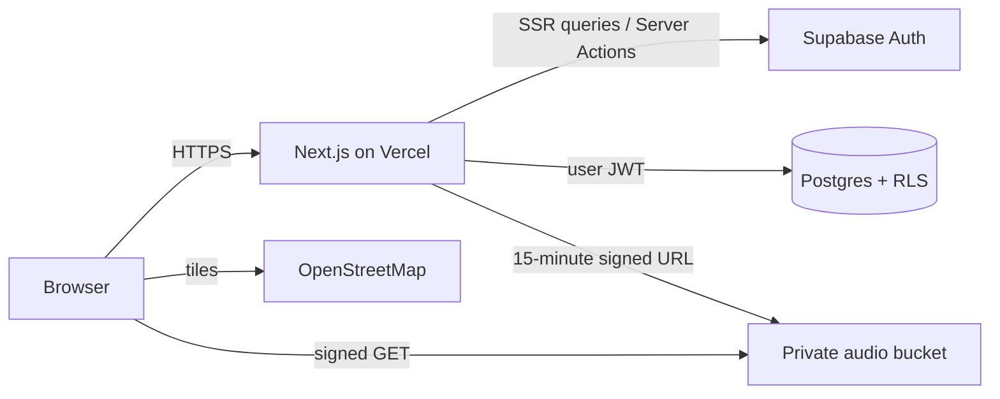
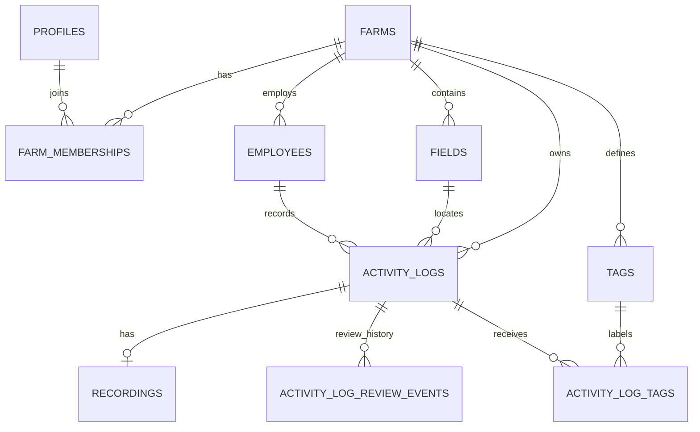

# Architecture and decision record

## Request flow

`proxy.ts` refreshes Supabase cookies, but it is intentionally not the authorization boundary. Dashboard rendering verifies auth again, tag creation verifies the user again, and Postgres RLS decides whether the resulting query is permitted.

## Data model

The `activity_log_details` view shapes the normalized model for the screen. `dashboard_metrics` computes the three cards from source rows, rather than persisting values that could drift. Both views use `security_invoker`, so their underlying RLS policies still apply.

## Security choices

- Browser code receives only the Supabase publishable key. The secret key is limited to the one-time bootstrap script.
- All tenant-owned tables have RLS enabled. Read access requires farm membership; tag mutation requires owner/manager membership.
- Server Action inputs are validated with Zod and ownership is re-derived from the selected activity log.
- Review state changes use a `security definer` database function: it locks the log, checks manager/owner membership, updates the current state, and writes a farm-scoped audit event atomically.
- Recordings live in a private bucket under `{farm_id}/…`; object policies validate the leading farm UUID.
- Audio links expire after 900 seconds.
- Auth cookies are HTTP-only and refreshed through Supabase's SSR client.

## Deliberate tradeoffs

- **Server-side filtering:** this challenge dataset is small, but URL-backed server filters make views shareable and keep the client bundle simple. At larger scale the same controls map to indexed SQL conditions and cursor pagination.
- **Leaflet instead of a static image:** the Paper/Figma map asset was not portable, and a real pan/zoom map better demonstrates full-stack product behavior. OSM avoids a required paid key; a production organization should review its tile-usage policy or use a commercial provider.
- **Demo credentials:** the one-click account minimizes reviewer friction. The password stays server-only. A consumer product would add normal invitation/login flows and rate limiting.
- **Local fallback:** reviewers can evaluate without secrets. It is intentionally labeled by implementation behavior and uses cookies only; hosted acceptance should always be tested against Supabase.
- **Generated demo waveform audio:** the repository does not redistribute an unknown source recording. Bootstrap creates a deterministic WAV in private Storage so playback and signed URLs can still be evaluated end-to-end.

## Production follow-ups

- Add structured logs/error monitoring and rate limits on sign-in and mutations.
- Move full-text search into Postgres once log volume warrants it.
- Review decisions use a database-owned transition function that writes an append-only audit event; production would add the same coverage for tag changes.
- Add storage retention/lifecycle rules and malware/content validation for user uploads.
- Run Supabase migration and Playwright smoke tests in CI for every pull request.
